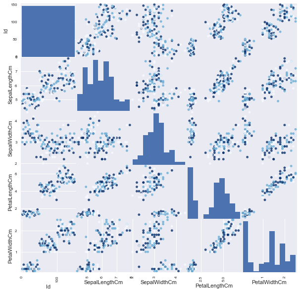
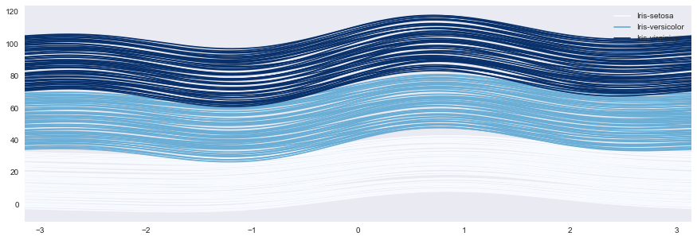
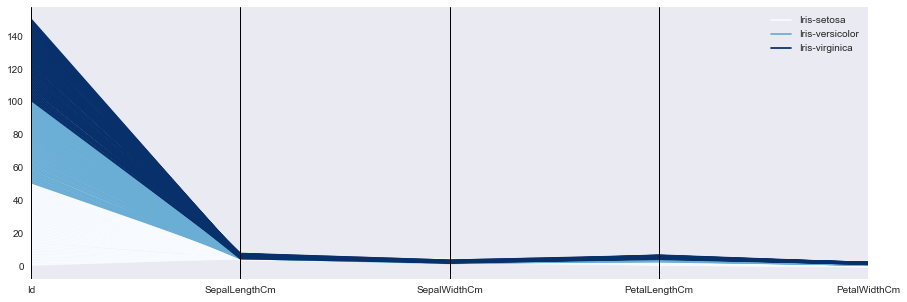
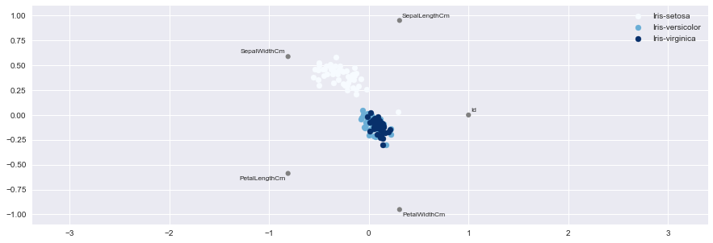

```python
import pandas as pd
import numpy as np
import matplotlib.pyplot as plt
import seaborn as sns
%matplotlib inline
```


```python
df = pd.read_csv("Iris.csv")
```


```python
groups = df.groupby('Species')
```


```python
corr = df.corr()
sns.heatmap(corr, annot=True, cmap='Blues')
```


    <matplotlib.axes._subplots.AxesSubplot at 0xb2a7940>


```python
from pandas.tools.plotting import scatter_matrix
colors = pd.tools.plotting._get_standard_colors(len(groups), colormap='Blues')
scatter_matrix(df, c=colors, figsize=(10, 10),marker='o', s=20, alpha=.8)
```


    array([[<matplotlib.axes._subplots.AxesSubplot object at 0x000000000B285B70>,
            <matplotlib.axes._subplots.AxesSubplot object at 0x000000000CEEFE48>,
            <matplotlib.axes._subplots.AxesSubplot object at 0x000000000CFB9A20>,
            <matplotlib.axes._subplots.AxesSubplot object at 0x000000000D0AE438>,
            <matplotlib.axes._subplots.AxesSubplot object at 0x000000000D1B3F28>],
           [<matplotlib.axes._subplots.AxesSubplot object at 0x000000000D229780>,
            <matplotlib.axes._subplots.AxesSubplot object at 0x000000000D33A438>,
            <matplotlib.axes._subplots.AxesSubplot object at 0x000000000D41ED68>,
            <matplotlib.axes._subplots.AxesSubplot object at 0x000000000D52A940>,
            <matplotlib.axes._subplots.AxesSubplot object at 0x000000000CFC9668>],
           [<matplotlib.axes._subplots.AxesSubplot object at 0x000000000D69D320>,
            <matplotlib.axes._subplots.AxesSubplot object at 0x000000000D799C88>,
            <matplotlib.axes._subplots.AxesSubplot object at 0x000000000D84C828>,
            <matplotlib.axes._subplots.AxesSubplot object at 0x000000000D9172B0>,
            <matplotlib.axes._subplots.AxesSubplot object at 0x000000000DD9EA20>],
           [<matplotlib.axes._subplots.AxesSubplot object at 0x000000000DEAB550>,
            <matplotlib.axes._subplots.AxesSubplot object at 0x000000000DF10C18>,
            <matplotlib.axes._subplots.AxesSubplot object at 0x000000000E017898>,
            <matplotlib.axes._subplots.AxesSubplot object at 0x000000000E10F208>,
            <matplotlib.axes._subplots.AxesSubplot object at 0x000000000E208E48>],
           [<matplotlib.axes._subplots.AxesSubplot object at 0x000000000E11EEF0>,
            <matplotlib.axes._subplots.AxesSubplot object at 0x000000000E3C7668>,
            <matplotlib.axes._subplots.AxesSubplot object at 0x000000000E444CC0>,
            <matplotlib.axes._subplots.AxesSubplot object at 0x000000000E57CC18>,
            <matplotlib.axes._subplots.AxesSubplot object at 0x000000000E6875C0>]], dtype=object)





```python
from pandas.tools.plotting import andrews_curves
plt.figure(figsize=(15, 5))
andrews_curves(df, 'Species',colormap='Blues')    
```


    <matplotlib.axes._subplots.AxesSubplot at 0xed866a0>





```python
from pandas.tools.plotting import parallel_coordinates
plt.figure(figsize=(15, 5))
parallel_coordinates(df, 'Species',colormap='Blues')
```


    <matplotlib.axes._subplots.AxesSubplot at 0xed867b8>





```python
from pandas.tools.plotting import radviz
plt.figure(figsize=(15, 5))
radviz(df, 'Species',colormap='Blues')
```


    <matplotlib.axes._subplots.AxesSubplot at 0xee8ad68>





```python

```
